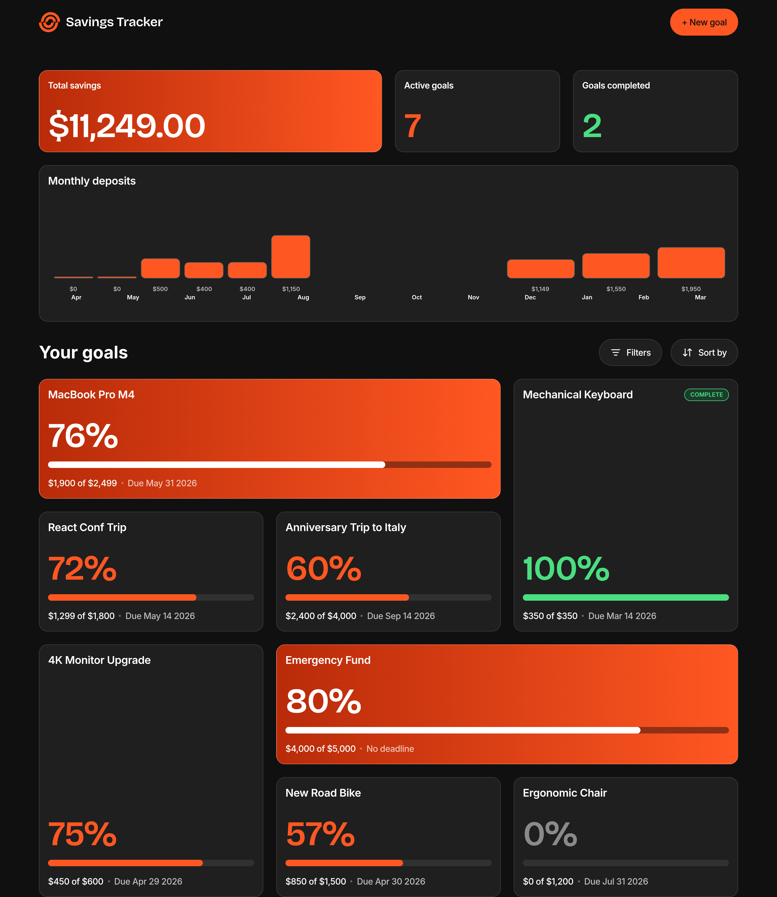
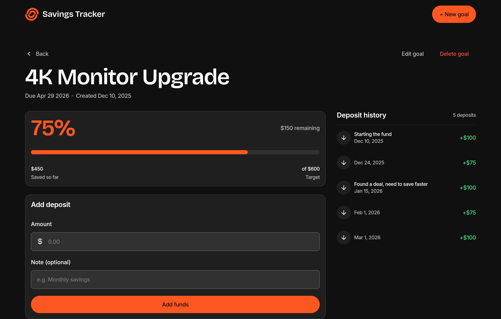

# Frontend Mentor - Savings Tracker solution

This is a solution to the [Savings Tracker challenge on Frontend Mentor](https://www.frontendmentor.io/challenges/savings-tracker). Frontend Mentor challenges help you improve your coding skills by building realistic projects. 

## Table of contents

- [Overview](#overview)
  - [The challenge](#the-challenge)
  - [Screenshot](#screenshot)
  - [Links](#links)
- [My process](#my-process)
  - [Built with](#built-with)
- [Author](#author)

## Overview

### The challenge

Users should be able to:

#### Goal Management

- Create a new savings goal with a name, target amount, and optional deadline
- Edit an existing goal to update its name, target amount, or deadline
- Delete a goal and see a confirmation modal before it's permanently removed
- See form validation messages if required fields are missing or invalid

#### Deposits

- Add a deposit to a goal with an amount and optional note
- See an error message when trying to add a deposit of $0 or less
- View the full deposit history for a goal, showing the note, date, and amount for each deposit

#### Dashboard

- View a summary showing total savings, number of active goals, and goals completed
- See a monthly deposits bar chart showing saving activity over time
- View all goals in a card grid with each goal's name, progress percentage, amount saved, target, and deadline
- See an empty state with a prompt to create a first goal when no goals exist
- See a completed state for goals that have reached their target

#### Filtering & Sorting

- Filter goals by status: all goals, in progress, completed, or not started
- Sort goals by recently added, deadline, progress, amount saved, or alphabetically

#### Goal Details

- View a goal's detail page showing progress percentage, remaining amount, a visual progress bar, and saved vs. target amounts
- See a different layout when a goal is 100% complete, showing a summary of total deposits and amount saved

#### UI & Accessibility

- View the optimal layout for the interface depending on their device's screen size
- See hover and focus states for all interactive elements on the page
- Navigate the entire app using only their keyboard

#### Bonus - Full-Stack (Optional)

- Sign up for an account with full name, email, and password
- Log in to an existing account
- Request a password reset via email
- Set a new password after receiving a reset link

### Screenshot

### Links

- Solution URL: [https://github.com/jkaps9/savings-tracker](https://github.com/jkaps9/savings-tracker)
- Live Site URL: [https://jkaps9.github.io/savings-tracker/](https://jkaps9.github.io/savings-tracker/)

## My process

### Built with

- Semantic HTML5 markup
- CSS custom properties
- Flexbox
- Mobile-first workflow
- [11ty](https://11ty.dev) - Static Site Generator
- [sass](https://sass-lang.com/) - CSS Preprocessor
- [Chart.js](https://www.chartjs.org/) - JavaScript charting library

## Author

- Frontend Mentor - [@jkaps9](https://www.frontendmentor.io/profile/jkaps9)
